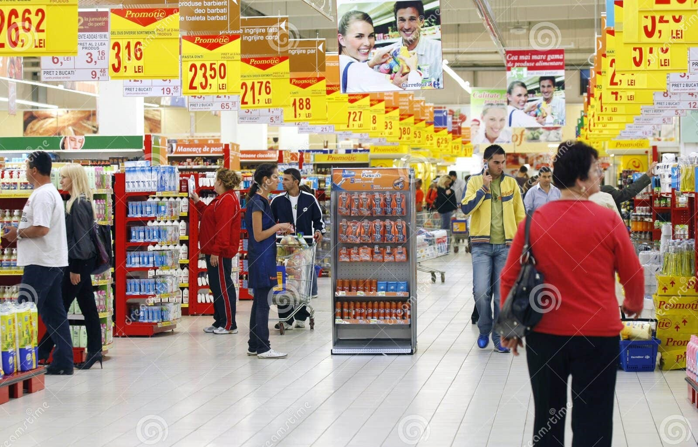

  # SUPERSTORE-ANALYSIS

## Introduction
This is a Power BI project on sales and profit analysis of a superstore, the project is to analyze and derive insights to answer crucial questions and help the store make data-driven decisions.
**_Disclaimer**_: _All datasets and reports do not represent any company, institution or country, but just a dummy dataset to show the capabilities of Power BI._

## Problem statement
1. Total Sales
2. Total profit
3. Total discount
4. Total discount
5. Sales and profit by ship mode
6. Sales and profit by product category
7. Sales and profit by segment
8. sales and profit by month and year

## Skills/concept demonstarted
The following Power BI features were incoporated-
- Data cleaning
-  changed data type
-   removed columns
-    slicers.

  ## Visualization

  The report comprisies of 2 pages.
  The first page shows visualization for sales while the second page shows the visualization for profit
  
  
  
  ## sales analysis

2017 had the highest total Sum of Sales at 733,215.26, followed by 2016, 2014, and 2015.   November in the Year 2017 made up 5.16% of the Sum of Sales.   2017 had the highest average Sum of Sales at 61,101.27, followed by 2016, 2014, and 2015.  
 At 256,368.16, New York City had the highest Sum of Sales and was 135.03% higher than Philadelphia, which had the lowest Sum of Sales at 109,077.01.  New York City accounted for 33.14% of the Sum of Sales.  

 

 ## profit analysis
 
 At 76,381.39, California had the highest Sum of Profit and was 310.70% higher than Virginia, which had the lowest Sum of Profit at 18,597.95. California accounted for 33.67% of Sum of Profit.  2017 had the highest total Sum of Profit at 93,439.27, followed by 2016, 2015, and 2014.  December in Year 2016 made up 6.07% of Sum of Profit.  2017 had the highest average Sum of Profit at 7,786.61, followed by 2016, 2015, and 2014.  Across all 5 City, Sum of Profit ranged from 13,181.79 to 62,036.98.  

  
  

